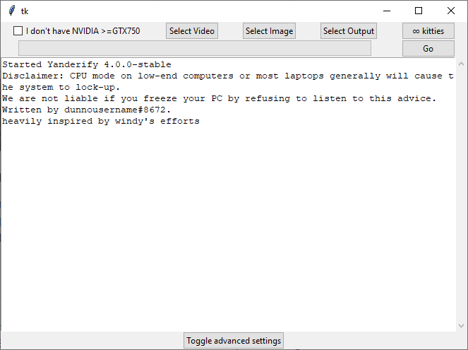

[**We're looking for new maintainers!**](https://github.com/dunnousername/yanderifier/issues/66)

[First-order-wrapper is not for making unethical, illicit or inappropriate content. Learn more here.](MANIFESTO.md)

## Yanderify is now known as first-order-wrapper to more accurately describe its function.
Since this project is no longer in active development, the name won't be changed everywhere.
However, I'm starting to update documentation on all of my projects to make them better, so the name change felt neccessary.
You can still refer to the project as Yanderify, and all of the links mentioning yanderify will continue to work. Changing the repo name would destroy any bookmarks or links to here, so that is not going to happen.
The old documentation lies below.

# first-order-wrapper
first-order-wrapper is a wrapper around [first-order-model](https://github.com/AliaksandrSiarohin/first-order-model). It exposes a simple user interface designed to be usable by anyone, with any level of technical skill. first-order-model was previously hard for the average person to use, since it required knowledge of the command line and installation of libraries. Yanderify eliminates these issues by providing a complete environment, with all necessary components bundled inside.

Please see the "releases" tab for the latest build. The repo is not necessarily up to date. However, [the latest-v4 branch](https://github.com/dunnousername/yanderifier/tree/latest-v4) contains the latest code as of this writing, while as of this writing, master contains code from 2 major versions back.

## What it does

first-order-model is an Artificial Intelligence that takes a source video and an image of a face, and animates the image to match the movement of the source image.

Here is an example of what first-order-model can do; this image was created by the [First Order Motion Model paper authors, and is taken from their repository](https://github.com/AliaksandrSiarohin/first-order-model). Most of the heavy lifting of Yanderify is done by code written by these paper authors, so I suggest you go check out their repository if you are interested.

## How it works

Double-clicking `yanderify.exe` will bring up a window that looks like this:

- "I don't have NVIDIA >=GTX750": checking this will enable CPU mode, which is a lot slower, but is the only method for users without a compatible graphics card.
- "Select Video": Clicking this will display a file selection box. This file should be the video you want to animate the new face to; in other words, this video will "drive" the image to move in the same way.
- "Select Image": This is a cropped picture of the face you want to be animated. In other words, this is the face that the video "wears".
- "Select Output": This is where your result will be stored.

Just hit "Go," and your video will be re-animated and re-encoded with the source audio!

## Addendum

Join our [discord server](https://discord.gg/KmFJNJYaA3) (updated again)
A lot of people have asked for me to make a twitter. I probably won't be very active on it, but here ya go: @dunnousername2
